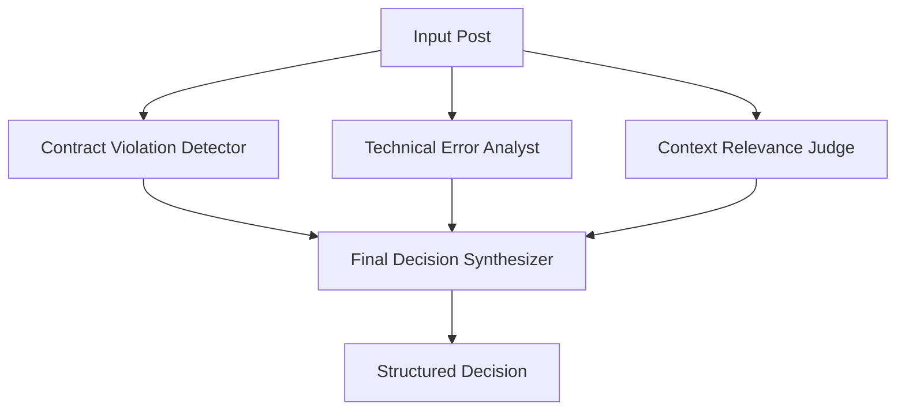

# LangChain Agentic LLM Screening Pipeline

## Overview

The Agentic LLM Screening Pipeline is a comprehensive multi-agent system built with LangChain for analyzing LLM API contract violations in GitHub issues and Stack Overflow posts. This system goes beyond traditional keyword filtering to provide deep, structured analysis through specialized AI agents.

## Architecture

### Multi-Agent System

The pipeline employs four specialized agents, each with domain expertise:



#### 1. Contract Violation Detector Agent
**Expertise**: LLM API contract specification and violation patterns
**Purpose**: Identifies explicit and implicit API usage contract violations

**Key Capabilities**:
- Parameter constraint violations (max_tokens, temperature, top_p)
- Rate limiting and quota violations
- Input format violations (JSON schema, function calling)
- Context length violations
- Authentication/authorization issues
- Response format violations

**Output**: `ContractViolationAnalysis`
```python
{
    "has_violation": bool,
    "violation_type": str,
    "confidence": float,
    "evidence": List[str],
    "violation_severity": str  # low, medium, high, critical
}
```

#### 2. Technical Error Analyst Agent
**Expertise**: Technical error patterns and root cause analysis
**Purpose**: Analyzes technical errors, their root causes, and API relationships

**Key Capabilities**:
- API connection errors (timeouts, SSL, DNS)
- Authentication errors (invalid keys, permissions)
- Request formatting errors (malformed JSON, headers)
- Parameter validation errors
- Rate limiting errors
- Response processing errors
- Model-specific errors

**Output**: `TechnicalErrorAnalysis`
```python
{
    "is_technical_error": bool,
    "error_category": str,
    "root_cause": str,
    "api_related": bool,
    "confidence": float,
    "error_patterns": List[str]
}
```

#### 3. Context Relevance Judge Agent
**Expertise**: LLM content relevance and quality assessment
**Purpose**: Evaluates content relevance to LLM API research and assesses quality

**Key Capabilities**:
- Direct LLM mentions (GPT-4, Claude, PaLM)
- API-specific terminology detection
- Technical concept identification
- Quality assessment (depth, research value, signal vs noise)
- Expert review recommendation

**Output**: `ContextRelevanceAnalysis`
```python
{
    "is_llm_related": bool,
    "relevance_score": float,
    "llm_indicators": List[str],
    "context_quality": str,  # poor, fair, good, excellent
    "requires_expert_review": bool
}
```

#### 4. Final Decision Synthesizer Agent
**Expertise**: Multi-factor decision synthesis and research prioritization
**Purpose**: Integrates all analyses into final screening decision

**Key Capabilities**:
- Evidence consistency evaluation
- Confidence weight calculation
- Quality gate enforcement
- Research value assessment
- Borderline case identification

**Output**: `FinalDecision`
```python
{
    "decision": str,  # Y, N, or Borderline
    "confidence": float,
    "rationale": str,
    "contract_types_identified": List[str],
    "recommended_action": str,
    "quality_flags": List[str]
}
```

## Comprehensive Prompting Strategies

### Contract Violation Detector Prompt
```
You are an expert LLM API contract violation detector. Your task is to analyze posts for explicit or implicit API usage contract violations.

CONTRACT TYPES TO DETECT:

1. PARAMETER CONSTRAINTS:
   - max_tokens: Must be positive integer, within model limits
   - temperature: Must be 0.0-2.0 (typically 0.0-1.0)
   - top_p: Must be 0.0-1.0, mutually exclusive with temperature in some APIs
   - frequency_penalty: Must be -2.0 to 2.0
   - presence_penalty: Must be -2.0 to 2.0

2. RATE LIMITING VIOLATIONS:
   - Requests per minute (RPM) exceeded
   - Tokens per minute (TPM) exceeded
   - Quota limitations
   - Billing/usage limits

[... detailed prompt continues ...]
```

### Technical Error Analyst Prompt
```
You are a technical error analysis expert specializing in LLM API integration issues. Analyze posts for technical errors, their root causes, and API relationships.

ERROR CATEGORIES TO IDENTIFY:

1. API CONNECTION ERRORS:
   - Network timeouts
   - SSL/TLS handshake failures
   - DNS resolution issues
   - Connection refused
   - Service unavailable

[... detailed prompt continues ...]
```

### Context Relevance Judge Prompt
```
You are a context relevance judge specializing in LLM-related content analysis. Evaluate whether content is relevant to LLM API research and assess its quality.

LLM RELEVANCE INDICATORS:

1. DIRECT LLM MENTIONS:
   - Specific models: GPT-3, GPT-4, Claude, PaLM, LLaMA
   - API providers: OpenAI, Anthropic, Google AI, Cohere
   - Libraries: langchain, transformers, openai-python

[... detailed prompt continues ...]
```

### Final Decision Synthesizer Prompt
```
You are the final decision synthesizer for LLM contract violation screening. Integrate multiple agent analyses to make the final screening decision.

DECISION CRITERIA:

POSITIVE (Y) - Include in research dataset:
1. Clear LLM API contract violations with evidence
2. Technical errors directly related to API usage
3. High-quality discussions of API limitations
4. Novel contract violation patterns
5. Well-documented integration issues

[... detailed prompt continues ...]
```

## Configuration System

### Screening Modes

```python
class ScreeningMode(Enum):
    TRADITIONAL = "traditional"  # DeepSeek-R1 + GPT-4.1
    AGENTIC = "agentic"          # Multi-agent LangChain
    HYBRID = "hybrid"            # Both approaches
```

### Environment Variables

```bash
# Screening configuration
export SCREENING_MODE=agentic
export AGENTIC_PROVIDER=openai
export AGENTIC_MODEL=gpt-4-1106-preview
export AGENTIC_TEMPERATURE=0.1
export AGENTIC_MAX_TOKENS=2000

# API keys
export OPENAI_API_KEY=your_openai_key
export ANTHROPIC_API_KEY=your_anthropic_key
export DEEPSEEK_API_KEY=your_deepseek_key

# Database
export MONGODB_CONNECTION_STRING=mongodb://localhost:27017/
export DATABASE_NAME=llm_contracts_research
```

### Configuration Profiles

#### Development Configuration
```python
config = get_development_config()
# - Reduced batch sizes
# - Limited data acquisition
# - Mock API endpoints
# - Local database
```

#### Production Configuration
```python
config = get_production_config()
# - Optimized for throughput
# - Large batch processing
# - Connection pooling
# - Performance monitoring
```

#### Research Configuration
```python
config = get_research_config()
# - Maximum quality settings
# - Detailed result storage
# - Higher reliability thresholds
# - Comprehensive logging
```

## Usage Examples

### Basic Agentic Screening

```python
from pipeline.llm_screening.agentic_screener import AgenticScreeningOrchestrator
from pipeline.common.config import get_research_config
from pipeline.common.database import MongoDBManager

# Setup
config = get_research_config()
db = MongoDBManager(config.database.connection_string)
await db.connect()

# Initialize orchestrator
orchestrator = AgenticScreeningOrchestrator(
    api_key=config.agentic_screening.contract_detector_llm.api_key,
    model_name=config.agentic_screening.contract_detector_llm.model_name,
    db_manager=db
)

# Screen a single post
filtered_post = await db.find_one('filtered_posts', {'_id': 'some_id'})
screening_result, detailed_analysis = await orchestrator.screen_post(filtered_post)

print(f"Decision: {screening_result.decision}")
print(f"Confidence: {screening_result.confidence}")
print(f"Rationale: {screening_result.rationale}")
```

### Batch Processing

```python
# Process batch of posts
batch_results = await orchestrator.screen_batch(
    batch_size=50,
    save_detailed_results=True
)

print(f"Processed: {batch_results['processed']}")
print(f"Positive: {batch_results['positive_decisions']}")
print(f"Negative: {batch_results['negative_decisions']}")
print(f"Borderline: {batch_results['borderline_cases']}")
```

### Individual Agent Analysis

```python
# Use individual agents
contract_agent = ContractViolationDetectorAgent(llm)
technical_agent = TechnicalErrorAnalystAgent(llm)
relevance_agent = ContextRelevanceJudgeAgent(llm)

# Analyze content
contract_analysis = await contract_agent.analyze(content, title)
technical_analysis = await technical_agent.analyze(content, title)
relevance_analysis = await relevance_agent.analyze(content, title, metadata)

# Synthesize decision
decision_agent = FinalDecisionSynthesizerAgent(llm)
final_decision = await decision_agent.synthesize(
    contract_analysis, technical_analysis, relevance_analysis
)
```

## Performance Characteristics

### Throughput
- **Parallel Agent Execution**: All agents run concurrently
- **Batch Processing**: Configurable batch sizes
- **Rate Limiting**: Automatic rate limit handling
- **Concurrent Posts**: Multiple posts processed simultaneously

### Quality Metrics
- **Structured Output**: Pydantic models ensure consistent parsing
- **Confidence Scoring**: Multi-factor confidence calculation
- **Fallback Mechanisms**: Graceful degradation on agent failures
- **Quality Gates**: Automatic quality validation

### Monitoring
- **Agent Performance Tracking**: Individual agent timing and success rates
- **Error Handling**: Comprehensive error capture and reporting
- **Provenance Tracking**: Full data lineage from input to decision
- **Statistical Analysis**: Decision distribution and confidence metrics

## Comparison with Traditional Screening

| Aspect | Traditional Screening | Agentic Screening |
|--------|---------------------|-------------------|
| **Analysis Depth** | Single-pass analysis | Multi-agent deep analysis |
| **Expertise** | General purpose | Domain-specialized agents |
| **Structured Output** | Simple decision + rationale | Rich structured analysis |
| **Quality Assessment** | Basic confidence score | Multi-dimensional quality metrics |
| **Borderline Handling** | Binary classification | Nuanced expert review routing |
| **Provenance** | Basic transformation log | Detailed agent analysis chain |
| **Customization** | Model/prompt tuning | Agent-specific optimization |
| **Research Value** | Screening decisions | Rich analytical insights |

## Integration with Research Pipeline

### Database Integration
```python
# Agentic results stored in dedicated collection
{
    'filtered_post_id': ObjectId,
    'screening_result': LLMScreeningResult,
    'detailed_agent_analyses': {
        'contract_detector': ContractViolationAnalysis,
        'technical_analyst': TechnicalErrorAnalysis,
        'relevance_judge': ContextRelevanceAnalysis,
        'decision_synthesizer': FinalDecision
    },
    'timestamp': datetime,
    'pipeline_version': 'agentic_v1.0'
}
```

### Provenance Tracking
```python
# Full transformation lineage
raw_post → filtered_post → agentic_screening_result → labelled_post
```

### Quality Gates
```python
# Automatic quality validation
if screening_result.confidence >= 0.8:
    priority = "high_confidence"
elif any(agent_result.errors for agent_result in detailed_results.values()):
    priority = "requires_review"
else:
    priority = "standard"
```

## Extension Points

### Custom Agents
```python
class CustomDomainAgent:
    def __init__(self, llm: LLM):
        self.llm = llm
        self.parser = PydanticOutputParser(pydantic_object=CustomAnalysis)
    
    async def analyze(self, content: str) -> CustomAnalysis:
        # Custom analysis logic
        pass
```

### Custom LLM Providers
```python
class CustomLLM(LLM):
    def _call(self, prompt: str, **kwargs) -> str:
        # Custom API integration
        pass
```

### Custom Decision Logic
```python
class CustomDecisionSynthesizer(FinalDecisionSynthesizerAgent):
    def _fallback_decision(self, *analyses) -> FinalDecision:
        # Custom fallback logic
        pass
```

## Troubleshooting

### Common Issues

1. **API Rate Limits**
   - Adjust `rate_limit_rpm` and `rate_limit_tpm` in LLM config
   - Increase delays between requests
   - Use different API keys for different agents

2. **Agent Failures**
   - Check API key validity
   - Verify network connectivity
   - Review prompt length vs model context limits
   - Enable fallback mechanisms

3. **Parsing Errors**
   - Structured output may fail for complex responses
   - OutputFixingParser can automatically retry
   - Fallback analysis provides basic results

4. **Performance Issues**
   - Reduce batch sizes
   - Disable parallel agent execution
   - Use faster models for non-critical agents

### Debug Mode
```python
import logging
logging.getLogger('pipeline.llm_screening.agentic_screener').setLevel(logging.DEBUG)

# Detailed agent timing and response logging
orchestrator = AgenticScreeningOrchestrator(..., debug=True)
```

## Future Enhancements

### Planned Features
- **Adaptive Prompting**: Dynamic prompt optimization based on performance
- **Agent Specialization**: Fine-tuned models for specific agent roles
- **Hierarchical Decision Making**: Multi-level decision trees
- **Real-time Learning**: Agent performance feedback loops
- **Vector Similarity**: Semantic similarity for borderline cases
- **Ensemble Methods**: Multiple model consensus

### Research Applications
- **Contract Pattern Discovery**: Automated pattern mining from decisions
- **Quality Prediction**: ML models for quality prediction
- **Taxonomy Evolution**: Dynamic taxonomy refinement
- **Cross-Platform Analysis**: Platform-specific behavior patterns

## Demo and Testing

Run the comprehensive demo:
```bash
cd examples
python agentic_screening_demo.py
```

The demo includes:
- Individual agent demonstrations
- Full pipeline processing
- Prompt engineering examples
- Configuration options showcase
- Mock data processing

## Dependencies

Install agentic pipeline requirements:
```bash
pip install -r requirements-agentic.txt
```

Key dependencies:
- `langchain>=0.1.0` - Core LangChain functionality
- `pydantic>=2.5.0` - Structured output parsing
- `httpx>=0.26.0` - Async HTTP client
- `numpy>=1.24.0` - Numerical operations
- Provider-specific packages (openai, anthropic, etc.)

---

The Agentic LLM Screening Pipeline represents a significant advancement in automated content analysis for LLM API contract research, providing unprecedented depth and structured insights for academic research applications. 