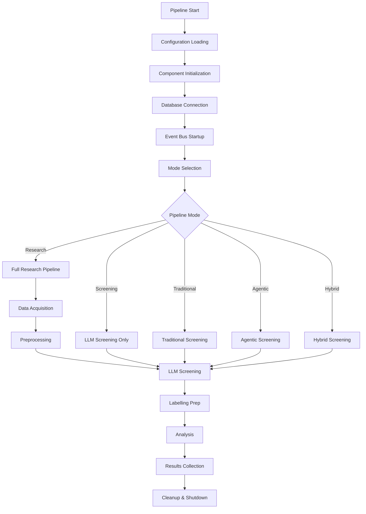
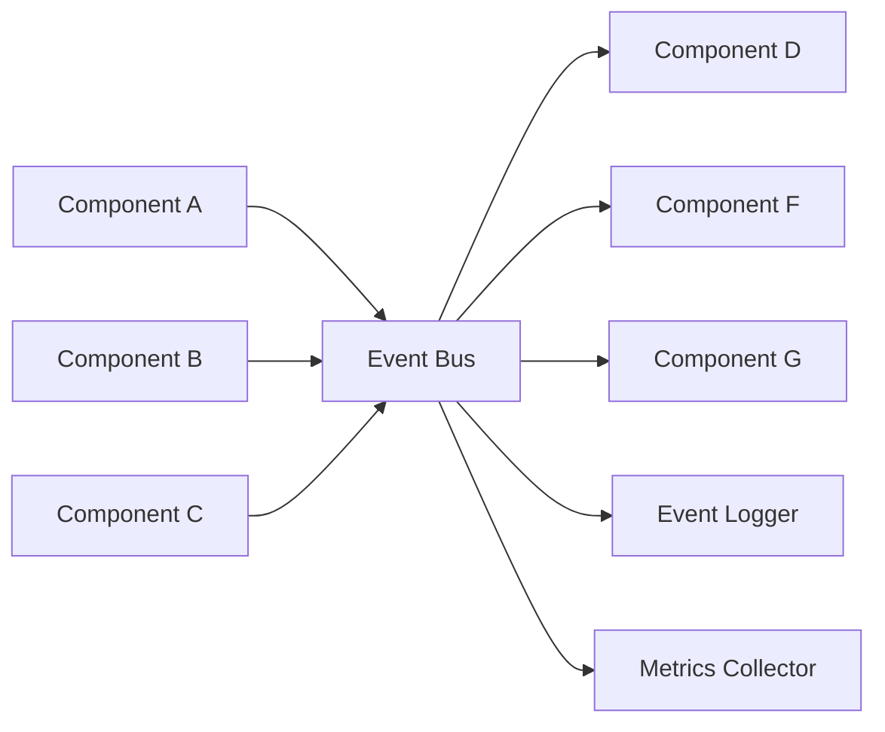

# LLM Contracts Research Pipeline - Architecture Documentation

## Overview

The LLM Contracts Research Pipeline features a modern, layered architecture designed for scalability, maintainability, and testability. This document provides detailed architectural information about the unified pipeline system.

## Architecture Layers

```
┌─────────────────────────────────────────────────────────────┐
│                    Orchestration Layer                      │
│  • UnifiedPipelineOrchestrator  • PipelineStepExecutor     │
│  • PipelineMode Management      • Stage Coordination       │
└─────────────────────────────────────────────────────────────┘
                              │
┌─────────────────────────────────────────────────────────────┐
│                       Core Layer                            │
│  • Interfaces (Abstract Base Classes)                       │
│  • Event System (Pub/Sub Event Bus)                        │
│  • Exception Hierarchy         • Type Definitions          │
└─────────────────────────────────────────────────────────────┘
                              │
┌─────────────────────────────────────────────────────────────┐
│                    Foundation Layer                         │
│  • Configuration Management  • Logging System               │
│  • Retry & Circuit Breaker  • Type Definitions            │
│  • Resource Management      • Performance Monitoring       │
└─────────────────────────────────────────────────────────────┘
                              │
┌─────────────────────────────────────────────────────────────┐
│                  Infrastructure Layer                       │
│  • Database Manager (MongoDB)  • Monitoring & Metrics       │
│  • Storage Abstraction        • External API Clients       │
│  • Health Checks             • Connection Pooling          │
└─────────────────────────────────────────────────────────────┘
```

## Layer Details

### 1. Orchestration Layer

**Purpose**: High-level coordination and execution management.

**Components**:
- **UnifiedPipelineOrchestrator** (`pipeline/orchestration/pipeline_orchestrator.py`)
  - Central coordinator for all pipeline operations
  - Mode-based execution (Research, Traditional, Agentic, Hybrid)
  - Stage lifecycle management
  - Error handling and recovery
  - Metrics collection and reporting

- **PipelineStepExecutor** (`pipeline/orchestration/step_executor.py`)
  - Individual step execution logic
  - Dependency management
  - Parallelization support
  - Resource allocation

**Key Features**:
- Circuit breaker pattern for resilience
- Event-driven stage coordination
- Comprehensive logging and metrics
- Type-safe operation with strong interfaces

### 2. Core Layer

**Purpose**: Fundamental abstractions and communication infrastructure.

**Components**:
- **Interfaces** (`pipeline/core/interfaces.py`)
  - Abstract base classes for all major components
  - Type-safe contracts for implementations
  - Standardized method signatures
  - Plugin architecture support

- **Event System** (`pipeline/core/events.py`)
  - Pub/Sub event bus implementation
  - Asynchronous event handling
  - Event filtering and routing
  - Component decoupling

- **Exception Hierarchy** (`pipeline/core/exceptions.py`)
  - Structured error handling
  - Pipeline-specific exception types
  - Error context preservation
  - Recovery strategy hints

**Key Features**:
- Async/await throughout
- Type safety with Pydantic
- Component isolation
- Extensible plugin system

### 3. Foundation Layer

**Purpose**: Shared utilities and cross-cutting concerns.

**Components**:
- **Configuration Management** (`pipeline/foundation/config.py`)
  - Unified environment and YAML configuration
  - Type-safe configuration with Pydantic validation
  - Environment-aware settings (dev/prod/research)
  - Hot configuration reloading

- **Logging System** (`pipeline/foundation/logging.py`)
  - Structured JSON logging
  - Correlation ID tracking
  - Context-aware logging adapters
  - Performance timing integration

- **Retry & Circuit Breaker** (`pipeline/foundation/retry.py`)
  - Configurable retry strategies
  - Exponential backoff algorithms
  - Circuit breaker for external APIs
  - Health monitoring integration

**Key Features**:
- Environment-specific optimizations
- Performance monitoring integration
- Resource management
- Cross-component consistency

### 4. Infrastructure Layer

**Purpose**: External system integrations and resource management.

**Components**:
- **Database Manager** (`pipeline/infrastructure/database.py`)
  - Async MongoDB operations
  - Connection pooling and health monitoring
  - Transaction support and bulk operations
  - Index management and query optimization

- **Monitoring & Metrics** (`pipeline/infrastructure/monitoring.py`)
  - Prometheus-compatible metrics collection
  - Performance tracking and timing
  - Health checks and alerting
  - Resource utilization monitoring

**Key Features**:
- High-performance async operations
- Automatic retry and recovery
- Comprehensive health monitoring
- Production-ready scalability

## Data Flow Architecture

### Pipeline Execution Flow



### Event-Driven Communication



## Component Interactions

### Configuration Flow

1. **Environment Loading**: Load from `.env` files and environment variables
2. **YAML Integration**: Merge YAML configuration files
3. **Validation**: Type-safe validation with Pydantic models
4. **Distribution**: Configuration manager distributes to all components
5. **Hot Reloading**: Dynamic configuration updates (development mode)

### Database Operations

1. **Connection Management**: Async connection pooling with health monitoring
2. **Query Execution**: Type-safe database operations with automatic retries
3. **Transaction Support**: ACID compliance for complex operations
4. **Index Management**: Automatic index creation and optimization
5. **Monitoring**: Performance tracking and health checks

### Event Processing

1. **Event Publishing**: Components publish typed events to the bus
2. **Event Routing**: Bus routes events to registered handlers
3. **Async Processing**: Non-blocking event handling
4. **Error Handling**: Failed event processing with retry logic
5. **Monitoring**: Event flow tracking and performance metrics

## Design Patterns

### 1. Dependency Injection

All components receive their dependencies through constructor injection:

```python
class UnifiedPipelineOrchestrator:
    def __init__(
        self,
        config: Optional[ConfigManager] = None,
        logger: Optional[PipelineLogger] = None,
        db_manager: Optional[DatabaseManager] = None,
        metrics: Optional[MetricsCollector] = None
    ):
        self.config = config or ConfigManager()
        self.logger = logger or PipelineLogger(__name__)
        # ...
```

### 2. Factory Pattern

Component creation through factory methods:

```python
def create_pipeline_orchestrator(mode: PipelineMode) -> UnifiedPipelineOrchestrator:
    config = get_config_manager()
    logger = create_logger(config)
    db = create_database_manager(config)
    metrics = create_metrics_collector(config)
    
    return UnifiedPipelineOrchestrator(
        config=config,
        logger=logger, 
        db_manager=db,
        metrics=metrics
    )
```

### 3. Observer Pattern (Event Bus)

Components subscribe to events of interest:

```python
@event_bus.subscribe("pipeline.stage.completed")
async def handle_stage_completion(event: StageCompletedEvent):
    await metrics.record_stage_completion(
        stage=event.stage,
        duration=event.duration,
        posts_processed=event.posts_processed
    )
```

### 4. Circuit Breaker Pattern

External API calls with failure handling:

```python
@with_circuit_breaker(failure_threshold=3, recovery_timeout=60)
async def call_llm_api(prompt: str) -> str:
    async with httpx.AsyncClient() as client:
        response = await client.post(api_url, json={"prompt": prompt})
        return response.json()["completion"]
```

## Performance Characteristics

### Scalability Features

- **Async Operations**: Non-blocking I/O throughout the pipeline
- **Connection Pooling**: Efficient database connection management
- **Batch Processing**: Optimized bulk operations for high throughput
- **Parallel Execution**: Concurrent processing where possible
- **Resource Limits**: Configurable limits to prevent resource exhaustion

### Performance Metrics

- **Traditional Screening**: ~2-3 posts/second with comment analysis
- **Agentic Screening**: ~0.5-1 posts/second with multi-agent processing
- **Database Operations**: Sub-millisecond queries with proper indexing
- **Event Processing**: <1ms event routing latency
- **Memory Usage**: Efficient streaming for large datasets

## Testing Architecture

### Test Organization

```
tests/
├── conftest.py              # Shared fixtures and configuration
├── test_core/               # Core layer tests
│   ├── test_events.py      # Event system tests
│   └── test_interfaces.py  # Interface contract tests
├── test_foundation/         # Foundation layer tests
│   ├── test_config.py      # Configuration management tests
│   ├── test_logging.py     # Logging system tests
│   └── test_retry.py       # Retry mechanism tests
├── test_infrastructure/     # Infrastructure layer tests
│   ├── test_database.py    # Database operations tests
│   └── test_monitoring.py  # Metrics collection tests
└── test_orchestration/     # Integration tests
    └── test_pipeline.py    # End-to-end pipeline tests
```

### Testing Strategies

1. **Unit Tests**: Component isolation with mocked dependencies
2. **Integration Tests**: Multi-component interaction validation
3. **End-to-End Tests**: Full pipeline execution validation
4. **Performance Tests**: Load testing and benchmark validation
5. **Contract Tests**: Interface compliance verification

### Test Fixtures

```python
@pytest_asyncio.fixture
async def event_bus():
    bus = EventBus()
    await bus.start()
    yield bus
    await bus.stop()

@pytest.fixture
def config_manager():
    return ConfigManager().load_test_config()

@pytest_asyncio.fixture
async def database_manager(config_manager):
    db = DatabaseManager(config_manager)
    await db.connect()
    yield db
    await db.disconnect()
```

## Security Considerations

### API Key Management

- Environment variable storage for all API keys
- Validation of API key format and accessibility
- No API keys in configuration files or version control
- Secure key rotation support

### Database Security

- Connection string validation and encryption
- Input sanitization for all database queries
- Role-based access control where applicable
- Audit logging for sensitive operations

### Event Security

- Event payload validation and sanitization
- Rate limiting for event publishing
- Secure event routing and filtering
- Event history retention policies

## Migration Path

### From Legacy Architecture

1. **Parallel Operation**: New and old architectures run side-by-side
2. **Gradual Migration**: Component-by-component migration
3. **Compatibility Layer**: Legacy interfaces maintained during transition
4. **Validation**: Comprehensive testing at each migration step
5. **Rollback Plan**: Ability to revert to legacy system if needed

### Legacy Compatibility

The new architecture maintains full backward compatibility:

```python
# Legacy code continues to work
from pipeline.main_pipeline import ResearchPipelineOrchestrator
from pipeline.common.config import PipelineConfig

config = PipelineConfig(
    mongodb_connection_string="mongodb://localhost:27017/",
    openai_api_key="sk-..."
)

# Legacy orchestrator delegates to new unified orchestrator
orchestrator = ResearchPipelineOrchestrator(config)
results = await orchestrator.run_full_pipeline()
```

## Future Extensions

### Planned Enhancements

1. **Real-time Dashboard**: Web-based monitoring and control interface
2. **Distributed Processing**: Multi-node pipeline execution
3. **Advanced ML Models**: Custom models for contract violation detection
4. **API Gateway**: RESTful API for external integrations
5. **Kubernetes Deployment**: Cloud-native deployment options

### Plugin Architecture

The core interfaces support extensible plugin development:

```python
class CustomScreeningPlugin(LLMScreeningInterface):
    async def screen_posts(self, posts: List[Post]) -> List[ScreeningResult]:
        # Custom screening implementation
        pass

# Register plugin
orchestrator.register_plugin("custom_screener", CustomScreeningPlugin())
```

This architecture provides a solid foundation for the LLM contracts research pipeline while maintaining flexibility for future enhancements and extensions.